<!--  -->

| Nexus                                                                   | nain4 processed                                                         | nain4 unprocessed                                                          |
|-------------------------------------------------------------------------|-------------------------------------------------------------------------|----------------------------------------------------------------------------|
| 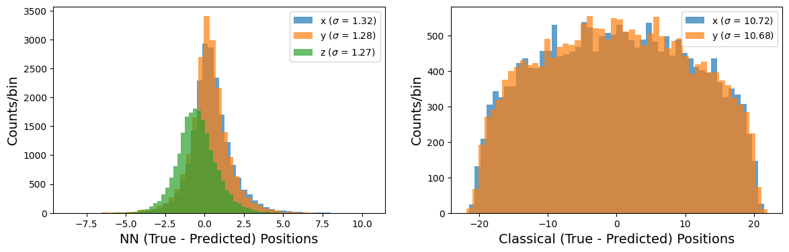   |    | 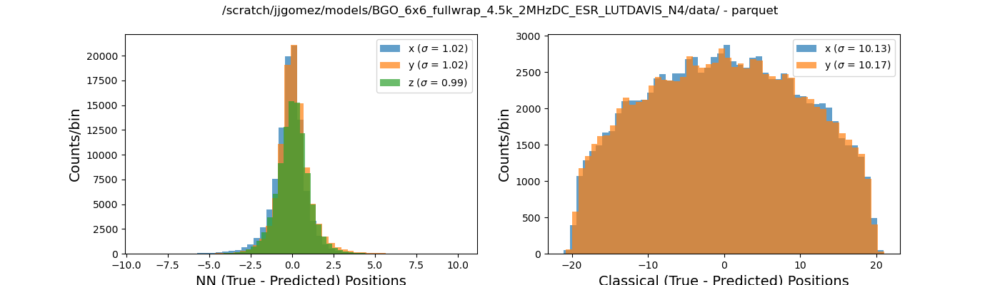   |
| 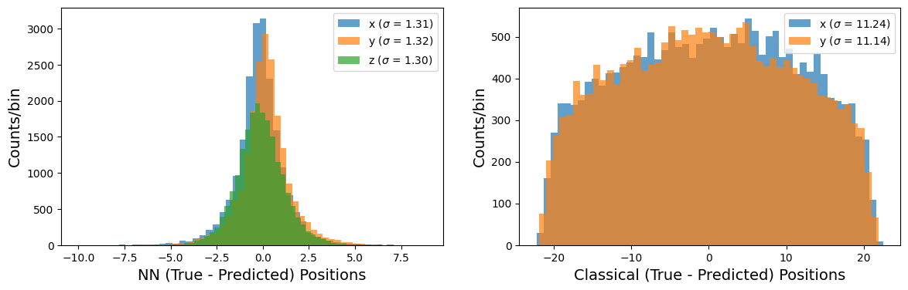        | 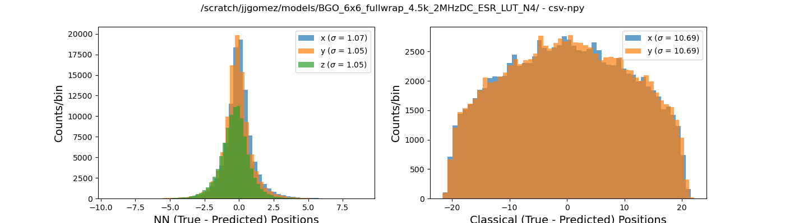        | 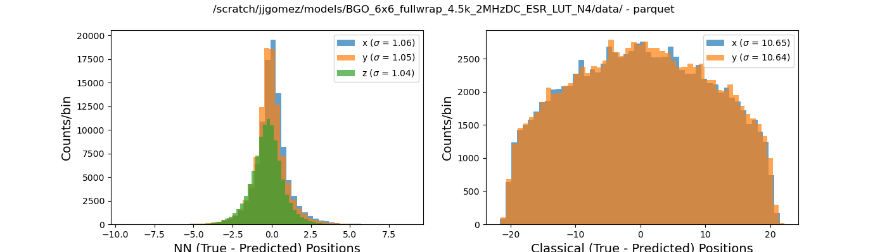        |
|   | 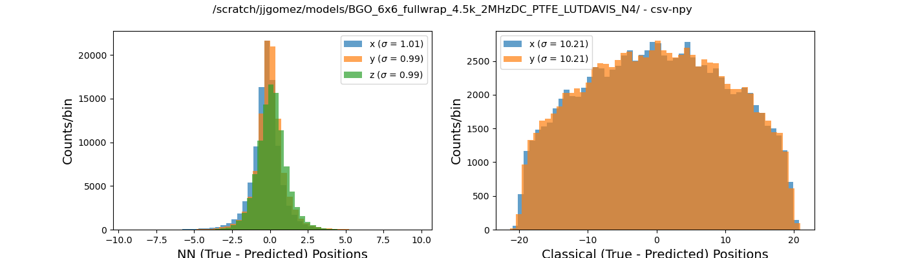  | 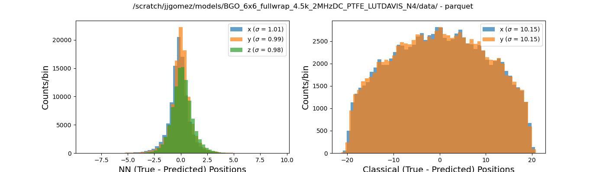  |
| 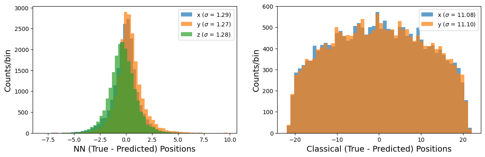       |        | 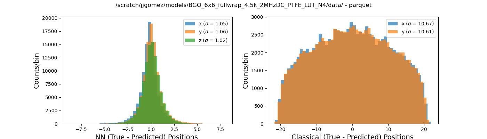       |
| 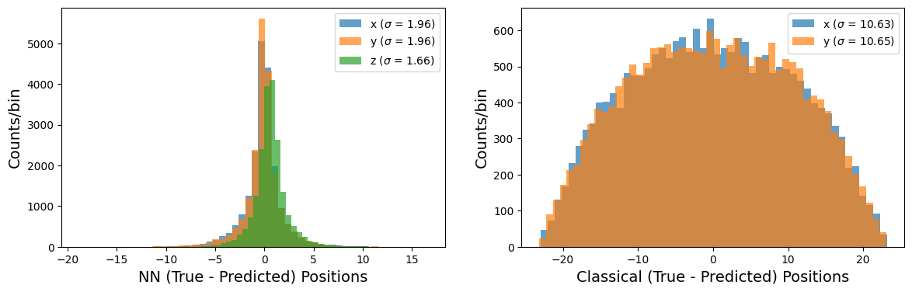  | 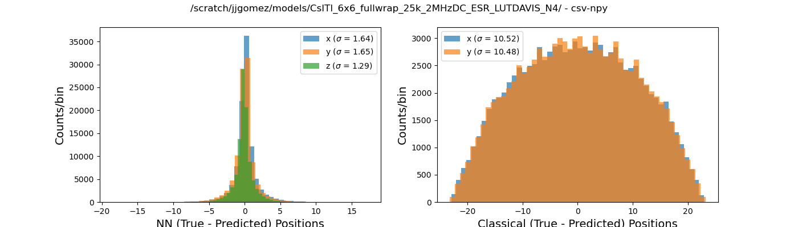  |   |
| 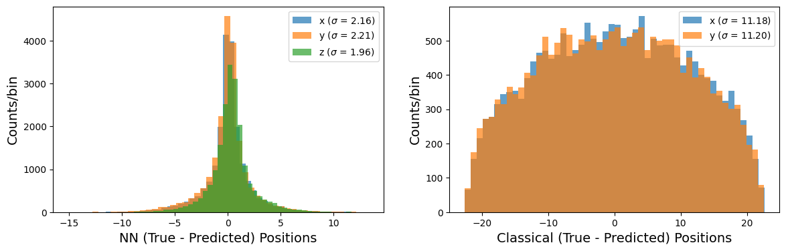       |        | 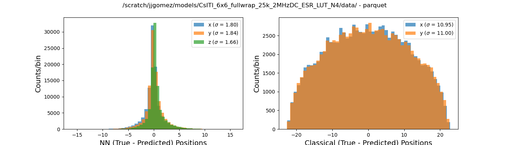       |
|  | 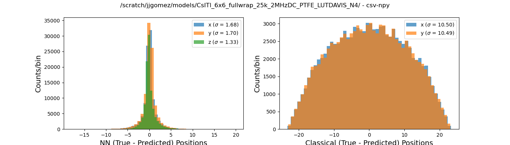 | 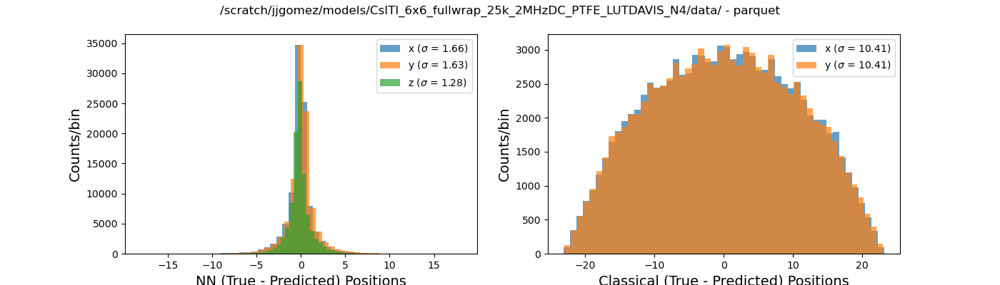 |
| 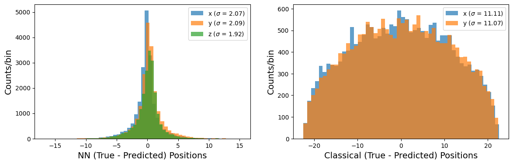      | 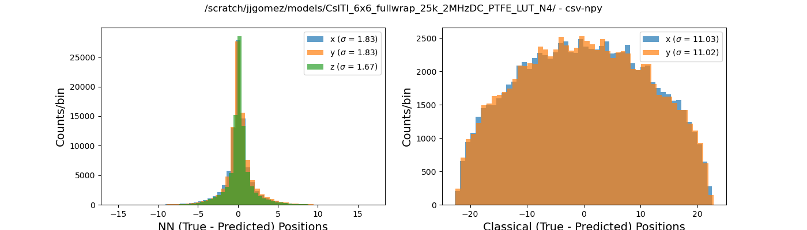      | 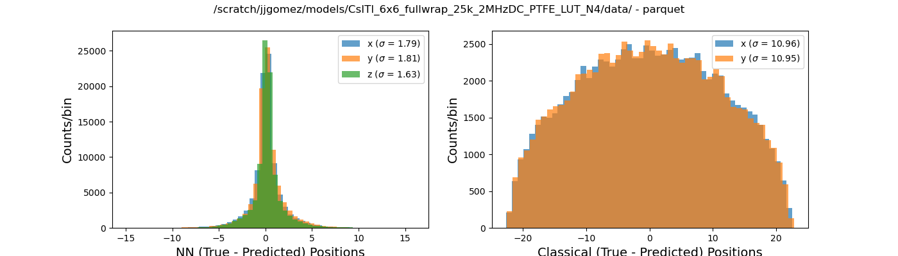      |
| 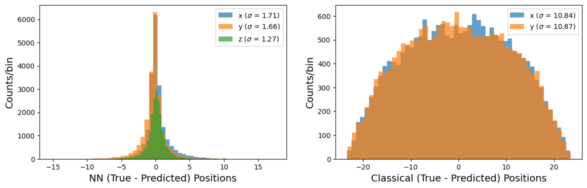   | 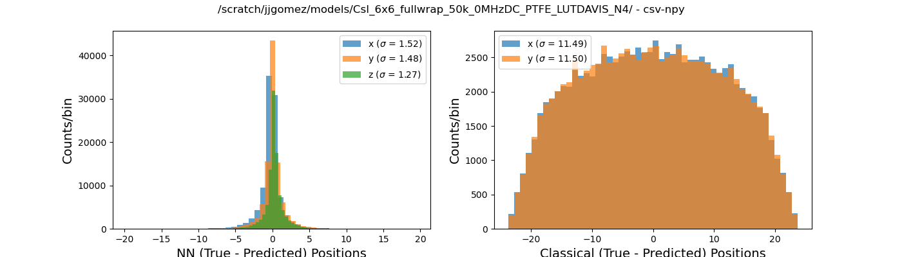   |    |
| 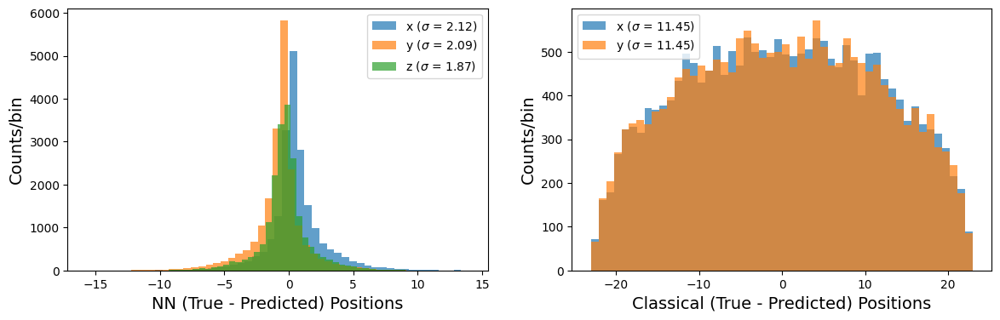        | 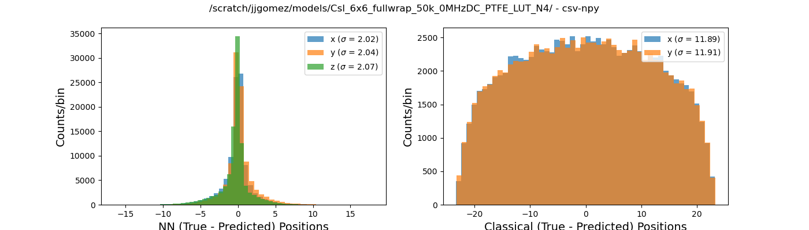        |         |
| 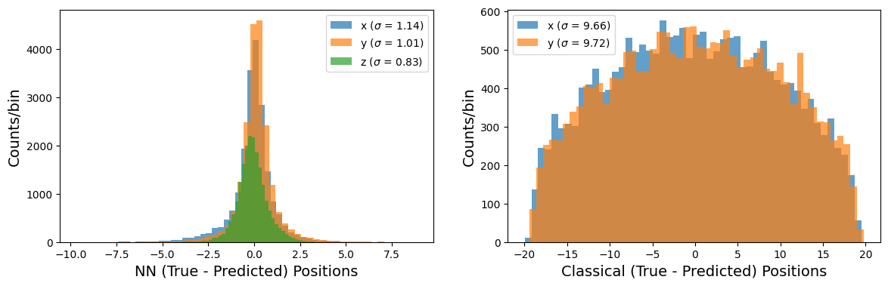  |   | 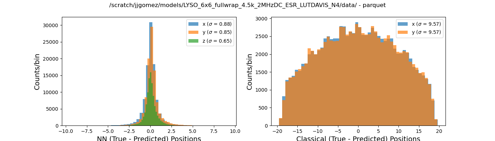  |
| 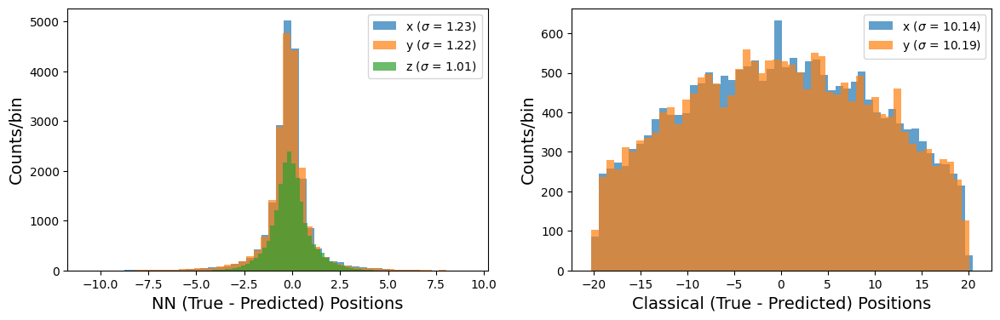       | 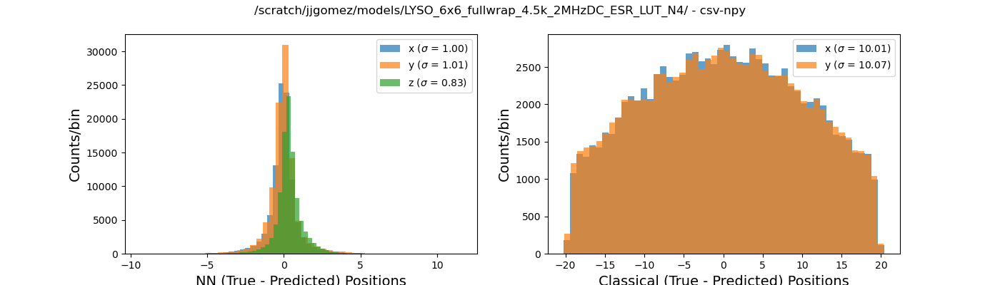       |        |
| 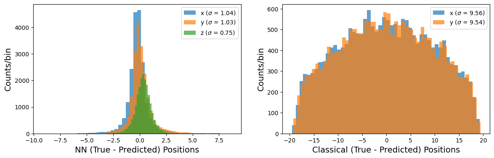 | 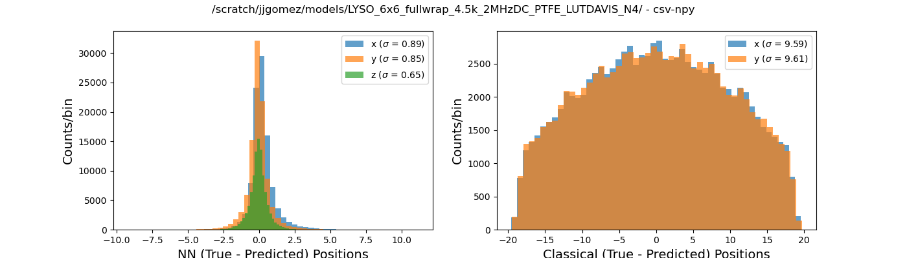 | 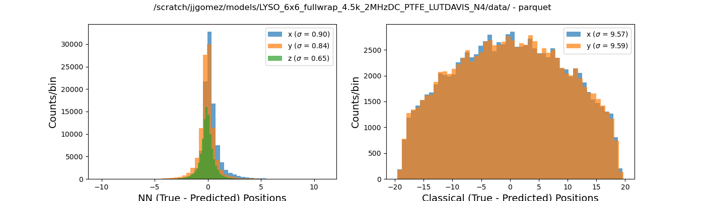 |
|       | 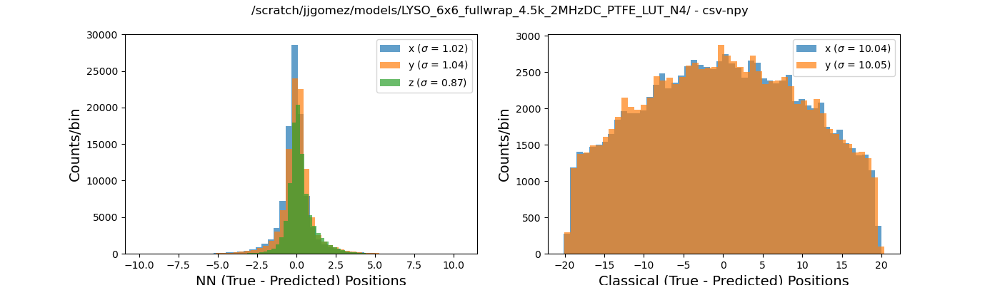      |       |
